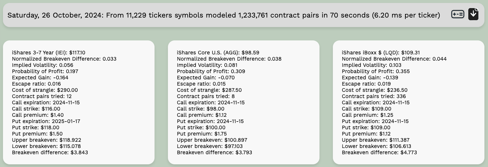

# [Edge Walker](https://edgewalker.co.uk)


## For experienced traders (TLDR)

Edge Walker is Python tool that uses the [Polygon API](https://polygon.io/) to search stock ticker collections for option contract pairs with the best-balanced strangles (strangles with the smallest breakeven differences).

## For those without options trading experience

Edge Walker is a software tool that searches for an idealized version of a trading strategy called a "strangle." This strategy involves purchasing options—financial contracts that give you the right to buy or sell a stock at a certain price in the future. Here are some basics or key terms about options trading and the strangle strategy that Edge Walker tries to idealize:

- **Options**: Financial contracts that give the buyer the right, but not the obligation, to buy or sell a stock at a specific price before a set expiration date. There are two types of options: calls and puts.
- **Call Option**: A contract that gives the buyer the right to buy a stock at a specific price (the strike price) before the option expires. Traders use call options when they expect the stock’s price to increase.
- **Put Option**: A contract that gives the buyer the right to sell a stock at a specific price (the strike price) before the option expires. Traders use put options when they expect the stock’s price to decrease.
- **Expiration**: The date by which the buyer must decide whether to exercise the option or let it expire. After the expiration date, the option becomes worthless.
- **Strike Price**: The price at which the buyer of the option can buy (for a call) or sell (for a put) the stock. The strike price is agreed upon when the option is purchased.
- **Premium**: The cost of buying an option contract.
- **Breakeven Price**: The stock price at which an options strategy results in neither a profit nor a loss. For a call option, the breakeven price is the strike price plus the premium paid. For a put option, it’s the strike price minus the premium.
- **Straddle**: A strategy where an investor buys both a call option and a put option for the same stock with the same strike price and the same expiration date. This strategy is used when the investor expects a price movement but is unsure of the direction.
- **Upper and Lower Breakeven Prices**: In a straddle, the upper breakeven price is the point at which the stock price needs to rise for the call option to break even. The lower breakeven price is where the stock must fall for the put option to break even. When the stock price is between the upper and lower breakeven prices, exercising would result in a loss. When the stock price is above the upper breakeven price or below the lower breakeven price, exercising would result in a profit.
- **Strangle**: Similar to a straddle, but the call and put options have different strike prices. They will have a different total cost or premium than a straddle, but will also have a different sized gap between the upper and lower breakeven prices.

Edge Walker searches for the most "balanced" strangles—those with the smallest difference, or narrowest gap, or sharpest edge, between the upper and lower breakeven prices. By sharpening this edge, you reduce the conditions under which losses occur. Edge Walker was made to try and find trades as near as possible to the ideal scenario in which the upper and lower breakeven prices are identical.

## Report layout

Edgewalker's main output is [a simple html report like this](https://edgewalker.co.uk/html/edgewalker_report.html). 



## Disclaimer

Edge Walker does minimal accounting for transaction fees when working out the cost of each strangle.  You you should edit these accordingly in `strangle_finder.py`.

```
# Calculate the strangle costs
contract_buying_fee = 0.53 + 0.55 # Brokerage-dependent cost
merged_df['strangle_costs'] = (
   merged_df['premium_call'] + merged_df['premium_put'] +
   2.0 * contract_buying_fee / 100.0
)
```

Edge Walker focuses entirely on exercising options, not on any profits or losses that could be had by selling or trading the options themselves. Often simply selling the options is the easier and more profitable way to close your position, but pricing that kind of close isn't as simple.

Edge Walker is provided "as is" without any guarantees or warranties. Use this code at your own risk. The author makes no promises about the code being error-free or trustworthy.

directory_structure = """
### Directory Structure

The project is organized into the following directories:

- **/** (root directory): Contains general project files such as the `README.md`, website configuration files (`CNAME`, `requirements.txt`), and other GitHub config files.
  
- **/html**: Stores generated reports, template reports, and recently generated CSV reports from Edge Walker's output.
  
- **/images**: Contains image files including the project logo and any relevant screenshots used for documentation or visualization.
  
- **/src**: This directory contains the main Python modules responsible for Edge Walker's core functionality. It also contains ticker lists and other support files.
  
- **/utility**: Contains helpful tools such as ticker scrapers, [a simple html-based strangle breakeven calculator](https://edgewalker.co.uk/utility/calculator.html), and a script `html2csv.py` that converts the HTML reports into CSV format if you prefer to poke around at the results as a spreadsheet.
"""

## Table of Contents

- [Introduction](#introduction)
- [Features](#features)
- [Requirements](#requirements)
- [Installation](#installation)
- [Usage](#usage)
- [Understanding the Output](#understanding-the-output)
- [Customization](#customization)
- [Contributing](#contributing)
- [License](#license)
- [Acknowledgments](#acknowledgments)
- [Contact](#contact)

## Introduction

An **options strangle** is an options strategy where an investor holds a position in both a call and a put with different strike prices but the same expiration date. Edge Walker automates the process of finding the most balanced strangles—those with minimal normalized breakeven differences—across multiple stock tickers. 
To improve EdgeWalker's effort to minimize breakeven differences, we allow the call and put to have unequal expiration dates, treating the most recent expiration as the expiration of the strangle. You can force matched expiration dates if you like.

## Features

- Fetches options data for a list of stock tickers using the Polygon.io API.
- Calculates breakeven points for various call and put combinations.
- Identifies the strangle with the smallest normalized breakeven difference for each ticker.
- Provides detailed output including strike prices, premiums, costs, and breakeven points.
- Measures execution time and provides performance metrics.
- Stores ticker collections in an external `tickers.json` file for easy management and customization.

## Requirements

- Python 3.11.5 or higher
- A Polygon.io API key with access to options data
- various python librarys described in `requirements.txt`

## Installation

1. **Clone the repository**

   ```bash
   git clone https://github.com/sdrasco/EdgeWalker.git
   ```

2. **Navigate to the project directory**

   ```bash
   cd EdgeWalker
   ```

3. Install the required packages

   ```bash
   pip install -r requirements.txt
   ```

## Usage

1. **Prepare the list of stock tickers**

   The tickers are stored in a `tickers.json` file. Edit this file to add or remove tickers as needed.  Here's an example:
   ```
   {
     "5_tickers": [
       "BIDU", "JD", "BABA", "FOUR", "BCAB"
     ],
     "25_tickers": [
       "BIDU", "JD", "BABA", "FOUR", "ABNB", "UBER", "BA", "BCAB", "ARM", "F", 
       "AMZN", "GOOGL", "INTC", "IWM", "JD", "META", "MSFT", "NFLX", "NVDA", "QQQ", 
       "SPY", "TSLA", "AAPL", "GME", "GERN"
     ],
   }
   ```

3. **Run the script**
   
   ```python 
   python src/edge_walker.py
   ```

4. **View the results**
   The script will output the best-balanced strangle for each ticker, along with detailed information about the options contracts.

### Understanding the Output

For each ticker, the script outputs something to the console. It could just be like this example:

```
AMZN: Nothing interesting.
```

which means that the best put/call contract pair isn't sufficiently low risk bother keeping a record of. This is what you should expect to see for most tickers, 
unless you've set a somewhat large value of `max_normalized_difference`, which you can edit in these lines from `src/main.py`

```
# Only put interesting results into reports or output
max_normalized_difference = 0.06
````
In cases where something interesting is found (sufficiently small Normalized Breakeven Difference) you will see an output like this example:

```
PIMCO Active Bond (BOND): $93.05
Normalized Breakeven Difference: 0.032
Escape ratio: 0.011
Variability Ratio: 0.000
Cost of strangle: $200.00
Contract pairs tried: 2
Call expiration: 2024-11-15
Call strike: $93.00
Call premium: $0.73
Put expiration: 2024-11-15
Put strike: $94.00
Put premium: $1.27
Upper breakeven: $95.011
Lower breakeven: $91.989
Breakeven difference: $3.021
```

### Execution Statistics

At the end of the execution, statistics are provided with details about the number of tickers processed, the number of requests sent to Polygon.io, the number of HTML panels generated, and the execution time. For example:

```
Number of tickers processed: 7,723
Number of contract pairs tried: 7,146,806
Execution time: 7301.55 seconds
Execution time per ticker: 0.95 seconds
```

## Contributing

Contributions are welcome! If you have suggestions or improvements, please fork the repository and create a pull request.

## License

This project is licensed under the GNU General Public License v3.0. See the LICENSE file for details.

## Contact

For questions or suggestions, please contact Steve Drasco at steve.drasco@gmail.com
