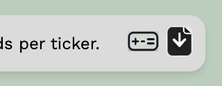
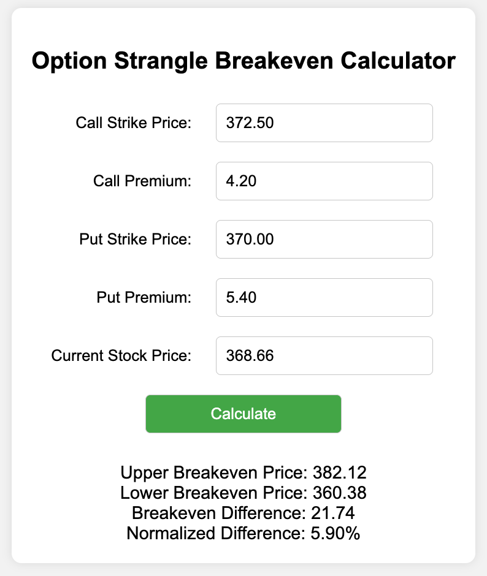
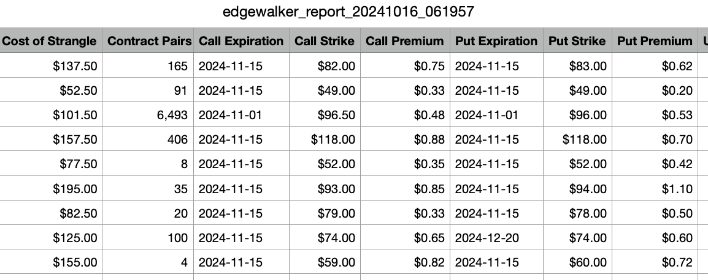

# [Edge Walker](https://edgewalker.co.uk)


## For experienced traders (TLDR)

Edge Walker is Python tool that uses the [Polygon API](https://polygon.io/) to search for options contract pairs with the smallest possible difference between their upper and lower breakeven points, minimizing the conditions for losses.

## For those without options trading experience

Edge Walker is a software tool that searches for an idealized version of a trading strategy called a "strangle." This strategy involves purchasing options—financial contracts that give you the right to buy or sell a stock at a certain price in the future. Here are some basics or key terms about options trading and the strangle strategy that Edge Walker tries to idealize:

- **Options**: Financial contracts that give the buyer the right, but not the obligation, to buy or sell a stock at a specific price before a set expiration date. There are two types of options: calls and puts.
- **Call Option**: A contract that gives the buyer the right to buy a stock at a specific price (the strike price) before the option expires. Traders use call options when they expect the stock’s price to increase.
- **Put Option**: A contract that gives the buyer the right to sell a stock at a specific price (the strike price) before the option expires. Traders use put options when they expect the stock’s price to decrease.
- **Expiration**: The date by which the buyer must decide whether to exercise the option or let it expire. After the expiration date, the option becomes worthless.
- **Strike Price**: The price at which the buyer of the option can buy (for a call) or sell (for a put) the stock. The strike price is agreed upon when the option is purchased.
- **Premium**: The cost of buying an option contract.
- **Breakeven Price**: The stock price at which an options strategy results in neither a profit nor a loss. For a call option, the breakeven price is the strike price plus the premium paid. For a put option, it’s the strike price minus the premium.
- **Straddle**: A strategy where an investor buys both a call option and a put option for the same stock with the same strike price and the same expiration date. This strategy is used when the investor expects a price movement but is unsure of the direction.
- **Upper and Lower Breakeven Prices**: In a straddle, the upper breakeven price is the point at which the stock price needs to rise for the call option to break even. The lower breakeven price is where the stock must fall for the put option to break even. When the stock price is between the upper and lower breakeven prices, exercising would result in a loss. When the stock price is above the upper breakeven price or below the lower breakeven price, exercising would result in a profit.
- **Strangle**: Similar to a straddle, but the call and put options have different strike prices. They will have a different total cost or premium than a straddle, but will also have a different sized gap between the upper and lower breakeven prices.

Edge Walker searches for the most "balanced" strangles—those with the smallest difference, or narrowest gap, or sharpest edge, between the upper and lower breakeven prices. By sharpening this edge, you reduce the conditions under which losses occur. Edge Walker was made to try and find trades as near as possible to the ideal scenario in which the upper and lower breakeven prices are identical.

## Expected Gains

Edge Walker calculates expected gains for each idealized strangle it finds. It’s important to note that negative expected gains are commonplace. While this might seem like something of a letdown, maximizing gain is not the primary focus of Edge Walker’s search. The goal is to uncover strangles with near-zero differences between upper and lower breakeven prices, to see how close to zero they can get, and to explore their unique characteristics. While the potential for profit is important, it is secondary to identifying and analyzing these intriguing setups.

## Screenshots

Edgewalker's main output is [a simple html report like this](https://edgewalker.co.uk/html/edgewalker_report.html). 


At the right of its header are two buttons



The first leads to a [simple html calculator for breakeven prices](https://edgewalker.co.uk/utility/calculator.html)

<p align="center">
  
</p>

The second downloads the data in the html report as a csv file.



## Fees etc.

Edge Walker does minimal accounting for transaction fees when working out the cost of each strangle.  You you should edit these accordingly in `/src/strangle_finder.py`.

```
# Calculate the strangle costs
contract_buy_and_sell_fee = 0.53 + 0.55 # Brokerage-dependent cost
merged_df['strangle_costs'] = (
   merged_df['premium_call'] + merged_df['premium_put'] +
   2.0 * contract_buy_and_sell_fee / 100.0
)
```
These are also hard coded in the simple html breakeven calculator `/utility/calculator.html`.
```
var contract_buy_and_sell_fee = 0.53 + 0.55
var strangle_costs = callPremium + putPremium + 2.0*contract_buy_and_sell_fee/100.0
```

Edge Walker focuses entirely on exercising options, not on any profits or losses that could be had by selling or trading the options themselves. Often simply selling the options is the easier and more profitable way to close your position, but pricing that kind of close isn't as simple.

## Disclaimer

Edge Walker is provided "as is" without any guarantees or warranties. Use this code at your own risk. The author makes no promises about the code being error-free or trustworthy.

## Directory Structure

The project is organized into the following directories:

- **/** (root directory): Project website and github configuration files
  
- **/html**: Generated reports, template reports, and recently generated CSV reports from Edge Walker's output.
  
- **/images**: Project logo and screenshots
  
- **/src**: The main Python modules responsible for Edge Walker's core functionality. It also contains ticker lists and other support files.
  
- **/utility**: Helpful tools such as ticker scrapers and [a simple html-based strangle breakeven calculator](https://edgewalker.co.uk/utility/calculator.html).

## Features

- Fetches options data for a list of stock tickers using the Polygon.io API.
- Calculates breakeven points for various call and put combinations.
- Identifies the strangle with the smallest normalized breakeven difference for each ticker.
- Provides detailed output including strike prices, premiums, costs, and breakeven points.
- Measures execution time and provides performance metrics.
- Stores ticker collections in an external `tickers.json` file for easy management and customization.

## Recent improvements:
- Significant speed optimization, by factor of about 1,000, by refactoring to asynchronous API calls. Searching all of NYSE and Nasdaq takes under a minute now.
- HTML reports now have buttons leading to calculator utility and to downloading CSV version of data.
- Convert all API calls to cusomized URL http get requests
- Modular code organization: The project is now divided into multiple `/src/*.py` files, making it easier to extend and reuse components.


## Future improvements

Pushbutton functionality to cards in HTML reports would be nice.
Clicking cards could, cylce though historical data or other analytics.

## Requirements

- Python 3.11.5 or higher
- A Polygon.io API key with access to options data
- various python librarys described in `requirements.txt`

## Installation

1. **Clone the repository**

   ```bash
   git clone https://github.com/sdrasco/EdgeWalker.git
   ```

2. **Navigate to the project directory**

   ```bash
   cd EdgeWalker
   ```

3. Install the required packages

   ```bash
   pip install -r requirements.txt
   ```

## Usage

1. **Prepare the list of stock tickers**

   The tickers are stored in a `tickers.json` file. Edit this file to add or remove tickers as needed.  Here's an example:
   ```
   {
     "5_tickers": [
       "BIDU", "JD", "BABA", "FOUR", "BCAB"
     ],
     "25_tickers": [
       "BIDU", "JD", "BABA", "FOUR", "ABNB", "UBER", "BA", "BCAB", "ARM", "F", 
       "AMZN", "GOOGL", "INTC", "IWM", "JD", "META", "MSFT", "NFLX", "NVDA", "QQQ", 
       "SPY", "TSLA", "AAPL", "GME", "GERN"
     ],
   }
   ```

3. **Run the script**
   
   ```python 
   python src/edge_walker.py
   ```

4. **View the results**
   The script will output the best-balanced strangle for each ticker, along with detailed information about the options contracts.

### The Output

Each time the code finds a ticker symbol with an interesting pair of options contracts, it creates a new card for the html report.  You can control what qualifies as interesting by setting the value of `max_normalized_difference`, in these lines from `src/main.py`

```
# Only put interesting results into reports or output
max_normalized_difference = 0.06
````

### Execution Statistics

At the end of the execution, statistics apear on the console describing the previous run, like this example:

```
Number of tickers processed: 7,723
Number of contract pairs tried: 7,146,806
Execution time: 7301.55 seconds
Execution time per ticker: 0.95 seconds
```

## Contributing

Contributions are welcome! If you have suggestions or improvements, please fork the repository and create a pull request.

## Licensing Information

This project is available under two license options:

1. **Open Source License (GPLv3)**:
   - You are free to use, modify, and distribute this project under the terms of the GPLv3 license.
   - If you choose this option, you must comply with the GPLv3 license, including the requirement to make any derivative works public under the same terms.

2. **Commercial License**:
   - For individuals or organizations wishing to use this project without complying with the GPLv3 terms (e.g., for private use or proprietary modifications), a commercial license is available.
   - Please contact Steve Drasco at steve.drasco@gmail.com for details on obtaining a commercial license.

For the full text of the GPLv3 license, see the [LICENSE](LICENSE) file in this repository.

## Contact

For questions or suggestions, please contact Steve Drasco at steve.drasco@gmail.com
