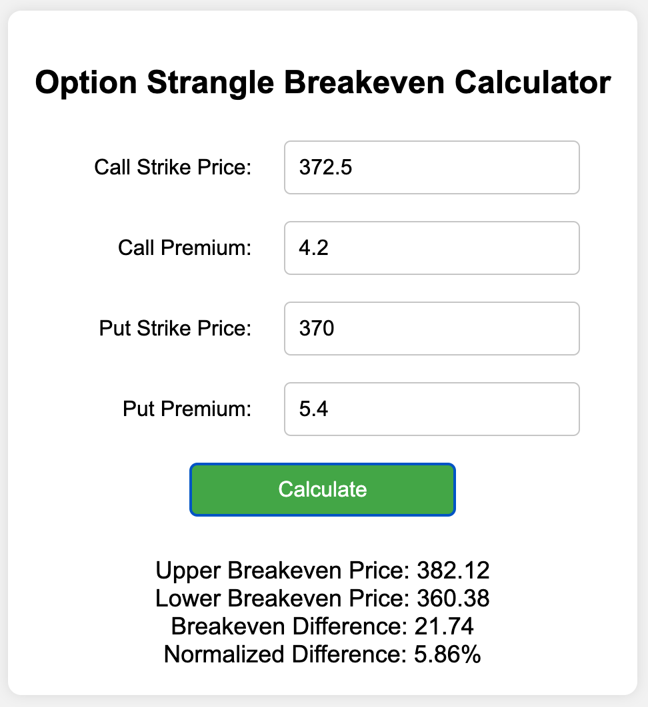
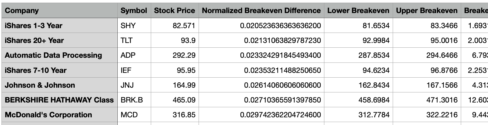
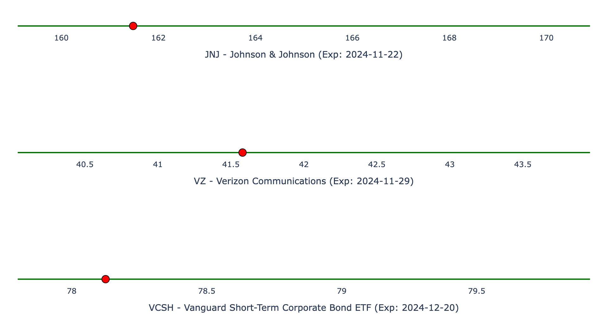

# [Edge Walker](https://edgewalker.co.uk)


## For experienced traders (TLDR)

Edge Walker is a Python tool leveraging the Polygon API to identify options contract pairs with the narrowest possible spread between their upper and lower breakeven points, minimizing potential losses. With its asynchronous architecture, Edge Walker takes about a minute to model all contract pairs in the 11,229 unique stock tickers that polygon knows of.

## For those without options trading experience

Edge Walker is a software tool that searches for an idealized version of a trading strategy called a "strangle." This strategy involves purchasing options—financial contracts that give you the right to buy or sell a stock at a certain price in the future. Here are some basics or key terms about options trading and the strangle strategy that Edge Walker tries to idealize:

- **Options**: Financial contracts that give the buyer the right, but not the obligation, to buy or sell a stock at a specific price before a set expiration date. There are two types of options: calls and puts.
- **Call Option**: A contract that gives the buyer the right to buy a stock at a specific price (the strike price) before the option expires. Traders use call options when they expect the stock’s price to increase.
- **Put Option**: A contract that gives the buyer the right to sell a stock at a specific price (the strike price) before the option expires. Traders use put options when they expect the stock’s price to decrease.
- **Expiration**: The date by which the buyer must decide whether to exercise the option or let it expire. After the expiration date, the option becomes worthless.
- **Strike Price**: The price at which the buyer of the option can buy (for a call) or sell (for a put) the stock. The strike price is agreed upon when the option is purchased.
- **Premium**: The cost of buying an option contract. These are the price per share for each contract.  Since each option contract gives you the right to buy or sell 100 shares, the cost of buying a contract is 100 times the premium (plus a small transaction fee on the scale of a dollar for the whole contract).
- **Breakeven Price**: The stock price at which an options strategy results in neither a profit nor a loss. For a call option, the breakeven price is the strike price plus the premium paid. For a put option, it’s the strike price minus the premium. 
- **Straddle**: A strategy where an investor buys both a call option and a put option for the same stock with the same strike price and the same expiration date. This strategy is used when the investor expects a price movement but is unsure of the direction.
- **Upper and Lower Breakeven Prices**: In a straddle, the upper breakeven price is the point at which the stock price needs to rise for the call option to break even. The lower breakeven price is where the stock must fall for the put option to break even. When the stock price is between the upper and lower breakeven prices, exercising would result in a loss. When the stock price is above the upper breakeven price or below the lower breakeven price, exercising would result in a profit.
- **Strangle**: Similar to a straddle, but the call and put options have different strike prices. They will have a different total cost or premium than a straddle, but will also have a different sized gap between the upper and lower breakeven prices.

Edge Walker searches for the most "balanced" strangles—those with the smallest difference, or narrowest gap, or sharpest edge, between the upper and lower breakeven prices. By sharpening this edge, you reduce the conditions under which losses occur. Edge Walker was made to try and find trades as near as possible to the ideal scenario in which the upper and lower breakeven prices are identical.  

While we'll describe the contract pairs that Edge Walker searches through as strangles, we won't actually insist on them having matching expiration dates. In that sense they are, at least potentially, expiration-decoupled strangles. Ultimately many of the trades Edge Walker identifies as most interesting turn out to have matched expirations, or strike prices, or both.

## Screenshots

Edgewalker's main output is [a simple html report like this](https://edgewalker.co.uk/html/edgewalker_report.html). 


At the right of its header are two buttons


The first leads to a [simple html calculator for breakeven prices](https://edgewalker.co.uk/utility/calculator.html)

<p align="center">
  
</p>

The second downloads the data in the html report as a csv file.



## Key Metrics and Calculations

Edge Walker computes and compiles key statistics, such as breakeven prices, for each strangle it identifies as potentially interesting. Below are explanations of additional metrics that may not be immediately clear based on their names alone.

### Implied Volatility

Implied volatility (IV) is a measure unique to option contracts.  It is a prediction of future stock price fluctuations. One can simply measure previous or historical volatility, which looks at past price movements. Unlike historical volatility, IV is not directly observed but is inferred from the market price for a contract and from models for how the market might arrive at that price. 

There are a variety of theoretical models used to predict the price of options contracts, such as the Black-Scholes model. 
These models contain a “free parameter”, future volatility, that must be set in order to predict the price of the contract. 
However, if instead of trying to work out the price of an option contract, we simply have a contract whose price has been set 
by market presures or dynamics, we can reverse-engineer the future volatility (IV) that makes the model’s price match the 
market price. In that sense, IV tells us how volatile the market expects, or the market price implies, the stock to be in the 
future. IV can then be treated as a prediction for the future. This enables other predictions, like probability of profit, 
expected gain, and so on. IV and things that are based on it are of course wrapped up in the model details, and the market may 
not in fact work in the way that the model might "think" it works.  Moreover, IV is different for each contract. So if a contract 
is especially unusual in terms of volume or other parameters (such as being a part of a strangle with near zero breakeven spread), 
it could very well also have an anamolous corrresponding IV.  Still, having a way to make even uncertain predictions about 
the future is handy.

Edge Walker doesn’t calculate implied volatility directly; instead, it retrieves this data from the Polygon API. If you're new to this and want to know more about implied volatility, [check out this Khan Academy video](https://youtu.be/VIHldsSmASU?si=Ri7P8Yjwt6U_s2bK). It gives a pretty clear and accessible introduction to the concept.

### Probability of Profit

Edge Walker calculates the probability of profit (POP) for each strangle by estimating the likelihood that the stock price will move beyond either the upper or lower breakeven point at expiration. This probability is influenced by factors such as implied volatility, time to expiration, and the current stock price. By accounting for potential stock price movement and including brokerage fees, Edge Walker uses statistical models to assess how likely it is that the strangle will result in a profitable outcome. 

### Expected Gain

Edge Walker calculates expected gains by estimating the potential outcomes of each strangle at the time of expiration. The calculation considers the premiums paid, brokerage fees, and the probability of the stock price moving beyond the breakeven points. Using historical stock data and implied volatility, Edge Walker models a range of possible stock prices at expiration and weights these outcomes by their likelihood. The result is an estimate of the expected gain for each strangle, which reflects the potential profit or loss under typical market conditions. 

### Escape Ratio

The escape ratio is just a simple measure used in Edge Walker to gauge how close the current stock price is to the nearest breakeven point. It is calculated by comparing the distance between the stock price and both breakeven points, then dividing by the current stock price. While not a profound metric, the escape ratio offers a quick snapshot of how much the stock needs to move to reach a breakeven position, helping to provide additional context when evaluating strangles.

## Search Parameters

A host of search parameters are scattered throught the code.  The greatest number of these are in `stranger_finder.py`, but some are also in `main.py` and `report_writer.py`.

## Fees

Edge Walker does minimal accounting for transaction fees when working out the cost of each strangle.  You you should edit these accordingly in `/src/strangle_finder.py`, 

```
contract_buy_and_sell_fee = 0.53 + 0.55
```
the simple html breakeven calculator `/utility/calculator.html`,

```
var contract_buy_and_sell_fee = 0.53 + 0.55
var strangle_costs = callPremium + putPremium + 2.0*contract_buy_and_sell_fee/100.0
```

and also in `/src/models.py`.

```
 brokerage_fee_per_contract: ClassVar[float] = 0.53 + 0.55
```

## Disclaimer

Edge Walker is provided "as is" without any guarantees or warranties. Use this code at your own risk. The author makes no promises about the code being error-free or trustworthy.

## Directory Structure

The project is organized into the following directories:

- **/** (root directory): Project website and github configuration files
  
- **/html**: Generated reports, template reports, and recently generated CSV reports from Edge Walker's output.
  
- **/images**: Project logo and screenshots
  
- **/src**: The main Python modules responsible for Edge Walker's core functionality. It also contains ticker lists and other support files.
  
- **/utility**: Helpful tools such as ticker scrapers and [a simple html-based strangle breakeven calculator](https://edgewalker.co.uk/utility/calculator.html).

## Features

- Fetches options data for a list of stock tickers using the Polygon.io API.
- Calculates breakeven points for various call and put combinations.
- Identifies the strangle with the smallest normalized breakeven difference for each ticker.
- Provides detailed output including strike prices, premiums, costs, and breakeven points.
- Measures execution time and provides performance metrics.
- Stores ticker collections in an external `tickers.json` file for easy management and customization.

## Recent improvements:
- Significant speed optimization, by factor of about 1,000, by refactoring to asynchronous API calls. Searching all of NYSE and Nasdaq takes under a minute now.
- HTML reports now have buttons leading to calculator utility and to downloading CSV version of data.
- Convert all API calls to cusomized URL http get requests
- Modular code organization: The project is now divided into multiple `/src/*.py` files, making it easier to extend and reuse components.

## Strangle Tracker Dashboard (Very Early Prototype)

We have a bisic monitor of your strangle positions with a clunky yet functional dashboard. The **Strangle Tracker** in `src/holdings.py` pulls live data from the Polygon.io API and keeps you updated every minute on each strangle's current price relative to its breakeven range.  This is very much a *first draft*, so no points for aesthetics just yet. It's not yet pretty, but it works nicely.

**Features**:
- Green lines show breakeven ranges and a big red dots mark the current prices.
- Each plot has your ticker, company name, and expiration date on the x-axis (edit the `strangles = []` object to reflect your holdings)

<p align="center">
  
</p>

Run `holdings.py` to see it in action on your local server at `http://127.0.0.1:8050/`.

## Future improvements

Pushbutton functionality to cards in HTML reports would be nice.
Clicking cards could, cylce though historical data or other analytics.

## Requirements

- Python 3.11.5 or higher
- A Polygon.io API key with access to options data
- various python librarys described in `src/requirements.txt`

## Installation

1. **Clone the repository**

   ```bash
   git clone https://github.com/sdrasco/EdgeWalker.git
   ```

2. **Navigate to the project directory**

   ```bash
   cd EdgeWalker
   ```

3. Install the required packages

   ```bash
   pip install -r src/requirements.txt
   ```

## Usage

1. **Prepare the list of stock tickers**

   The tickers are stored in a `tickers.json` file. Edit this file to add or remove tickers as needed.  Here's an example:
   ```
   {
     "5_tickers": [
       "BIDU", "JD", "BABA", "FOUR", "BCAB"
     ],
     "25_tickers": [
       "BIDU", "JD", "BABA", "FOUR", "ABNB", "UBER", "BA", "BCAB", "ARM", "F", 
       "AMZN", "GOOGL", "INTC", "IWM", "JD", "META", "MSFT", "NFLX", "NVDA", "QQQ", 
       "SPY", "TSLA", "AAPL", "GME", "GERN"
     ],
   }
   ```

3. **Run the script**
   
   ```python 
   python src/edge_walker.py
   ```

4. **View the results**
   The script will output the best-balanced strangle for each ticker, along with detailed information about the options contracts.

### The Output

Each time the code finds a ticker symbol with an interesting pair of options contracts, it creates a new card for the html report.  You can control what qualifies as interesting by setting the value of `max_normalized_difference`, in these lines from `src/main.py`

```
# Only put interesting results into reports or output
max_normalized_difference = 0.06
````

### Execution Statistics

At the end of the execution, statistics apear on the console describing the previous run, like this example:

```
Number of tickers processed: 7,723
Number of contract pairs tried: 7,146,806
Execution time: 7301.55 seconds
Execution time per ticker: 0.95 seconds
```

## Contributing

Contributions are welcome! If you have suggestions or improvements, please fork the repository and create a pull request.

## Licensing Information

This project is available under two license options:

1. **Open Source License (GPLv3)**:
   - You are free to use, modify, and distribute this project under the terms of the GPLv3 license.
   - If you choose this option, you must comply with the GPLv3 license, including the requirement to make any derivative works public under the same terms.

2. **Commercial License**:
   - For individuals or organizations wishing to use this project without complying with the GPLv3 terms (e.g., for private use or proprietary modifications), a commercial license is available.
   - Please contact Steve Drasco at steve.drasco@gmail.com for details on obtaining a commercial license.

For the full text of the GPLv3 license, see the [LICENSE](LICENSE) file in this repository.

## Contact

For questions or suggestions, please contact Steve Drasco at steve.drasco@gmail.com
